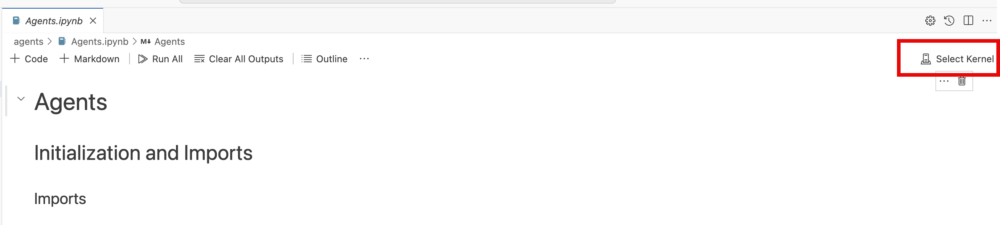
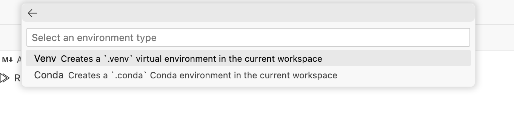
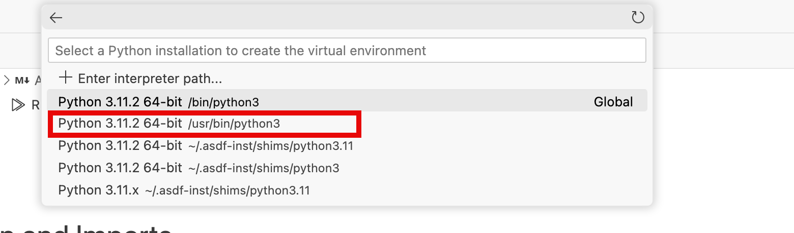
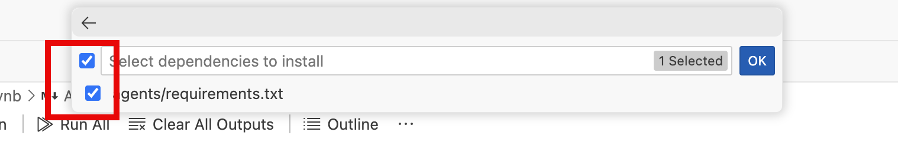
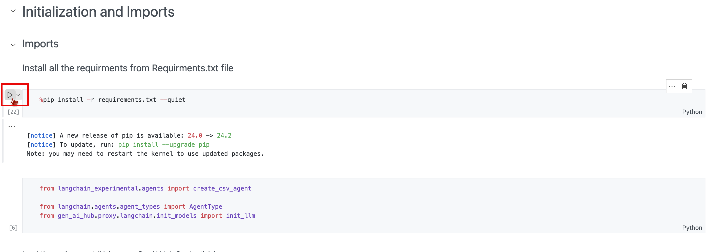

# Agents Hands-On
The core idea of agents is to use a language model to choose a sequence of actions to take. In chains, a sequence of actions is hardcoded (in code). In agents, a language model is used as a reasoning engine to determine which actions to take and in which order.

## Pre-requisites:

1. Subscription to SAP Business Application Studio.
2. Generative AI Hub Credentials (As used previously)

## Getting started

- Open the cloned repo & navigate to Agents.ipynb file in the agents folder.
- Click on Select Kernel, choose python environments & click on create Python environments.

    

- Click on Venv as environment type.

    

- Select /usr/bin/python3 for Python installation to create virtual environment.

    

- Tick mark the requirements.txt check box to install the required packages.

    

- You're now all set to try out the Agentic workflow with csv agents!
- Now execute cell one by one. Click on the icon as shown for each cell.
    

## Reference

- https://python.langchain.com/v0.1/docs/modules/agents/
- https://python.langchain.com/v0.1/docs/modules/agents/concepts/
- https://python.langchain.com/v0.2/docs/integrations/toolkits/csv/
- https://python.langchain.com/v0.1/docs/modules/agents/quick_start/
